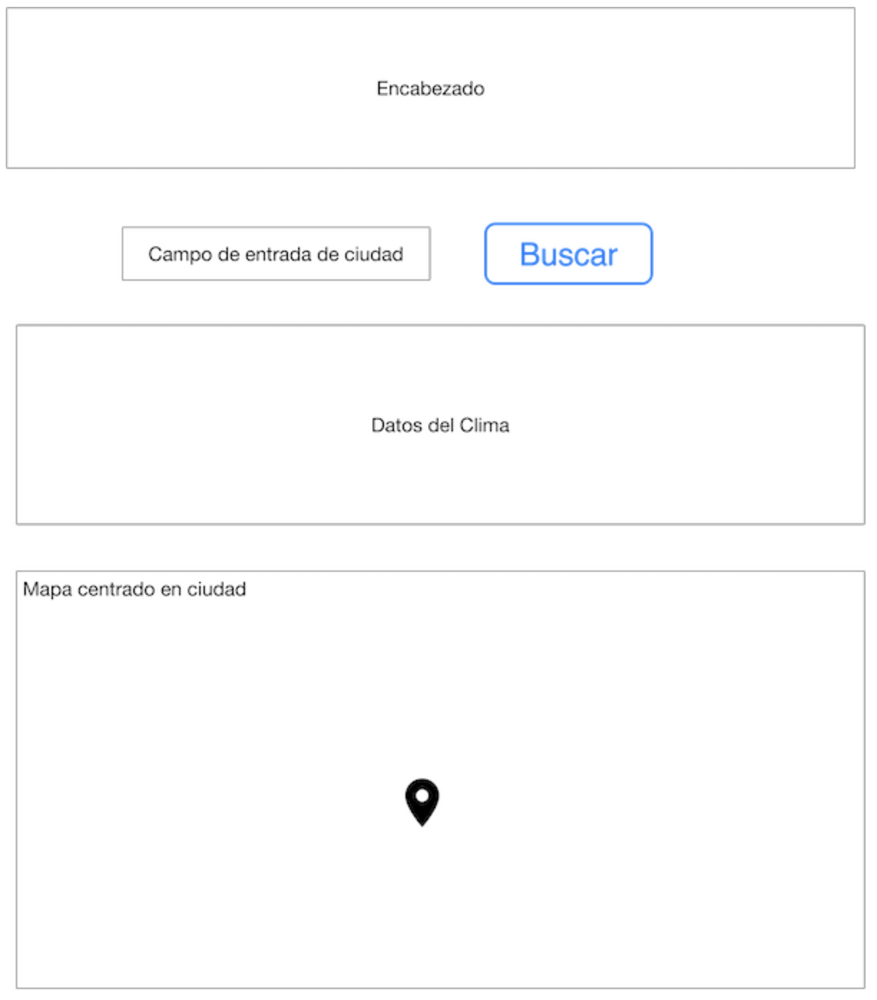

# Escuela Colombiana de Ingeniería Julio Garavito - Arquitecturas de Software ARSW - Parcial Segundo Tercio


## Autor ✒️

* Juan Sebastián Frásica Galeano

## Comenzando 🚀

Enlace de la aplicación en Heroku:
[](https://openweather-arsw.herokuapp.com/)

### Pre-requisitos 📋

* Java 8
* Maven (Apache Maven)
* Git


### Instalación 🔧

1. Clonar el repositorio

```
git clone https://github.com/sebastianfrasic/Parcial-2T-ARSW.git
```

2. En una terminal:

```
mvn package
```


3. Para ejecutar la aplicación

```
mvn spring-boot:run
```
Para poder utilizar la aplicación de manera local, diríjase a su navegador web de preferencia, y escriba:

```
localhost:8080
```

4. Si desea ver la documentación de la aplicación la podrá encontrar en el directorio _javadoc_


## Construido con 🛠️

* Java 8
* Spring Boot Framework
* JavaScript
* HTML
* jQuery
* Ajax
* [Maven](https://maven.apache.org/) - Manejador de dependencias


## Preparación para el Parcial

Con el objetivo de preparar el examen final del segundo tercio, por favor siga las siguientes instrucciones.

1. Explore el API de OpenWeather en el siguiente [enlace](https://openweathermap.org/ ).
2. Use la colección de Postman adjunta para validar el funcionamiento del endpoint por fuera de la página de OpenWeather.
3. Si no ha terminado por completo el último laboratorio, hagalo, si es necesario desde el inicio y completo. En ese laboratorio esta basado el parcial.
4. Revise la documentación de Google Maps para agregar marcadores a un mapa o revise este [Codepen](https://codepen.io/SitePoint/pen/YWKLzv?editors=0110)

## Descripción del Problema a Solucionar

Parcial del segundo tercio

Su compañía lo ha seleccionado para construir una aplicación para consultar el estado del clima en lugares específicos de la tierra.  

La aplicación recibirá en un campo el nombre de una ciudad, por ejemplo `London` para Londres y deberá mostrar la información del clima para esa ciudad. Para esto utilice el API gratuito de [openweathermap](https://openweathermap.org/ ) (Puede crear una cuenta para obtener la llave para realizar consultas). Se le pide que su implementación sea eficiente en cuanto a recursos así que debe implementar un caché que permita evitar hacer consultas repetidas al API externo. Una vez tenga la funcionalidad básica, extienda su implementación para incluir una funcionalidad para mostrar mapas de la ciudad con diferentes capas del clima (revise la funcionalidad del API de mapas de clima y el ejemplo anexo.). La implementación del mapa puede ir directamente a los servicios externos sin pasar por el servidor intermediario.
Sugerencia realice la implementación de manera incremental. Haga commits regulares.

Ejemplo de la interfaz gráfica



La arquitectura debe tener las siguientes características.

1. El cliente Web debe ser un cliente asíncrono que use servicios REST desplegados en Heroku y use Json como formato para los mensajes.
2. La aplicación debe estar desplegada en Heroku.
3. El servidor de Heroku servirá como un gateway para encapsular llamadas a otros servicios Web externos.
4. La aplicación debe ser multiusuario (Sin registro y sin seguridad )
5. Todos los protocolos de comunicación serán sobre HTTP.
6. Los formatos de los mensajes de intercambio serán siempre JSON.
7. La interfaz gráfica del cliente debe ser los más limpia y agradable posible y debe utilizar Bootstrap. Para invocar métodos REST desde el cliente usted puede utilizar la tecnología que desee.
8. Debe construir un cliente Java que permita probar las funciones tanto del servidor fachada como del cliente externo. El cliente utiliza simples conexiones http para conectarse a los servicios. Este cliente debe hacer pruebas de concurrencia a sus servidor Spring.
9 .La fachada de servicios tendrá un caché que permitirá que llamados que ya se han realizado a las implementaciones concretas con parámetros específicos no se realicen nuevamente. Puede almacenar el llamado como un String con su respectiva respuesta, y comparar el string respectivo. Recuerde que el caché es una simple estructura de datos.
10. Si el dato del cache tiene más de 5 min se debe solicitar nuevamente al servidor externo.
11. Se debe poder extender fácilmente, por ejemplo, es fácil agregar nuevas funcionalidades, o es fácil cambiar el proveedor de una funcionalidad.
12. Debe utilizar maven para gestionar el ciclo de vida, git y github para almacenar al código fuente y heroku como plataforma de producción.

## Entrega

1. La aplicación funcionando en Heroku con el nombre (APELLIDO-ARSW-T2) y el código fuente almacenado en un proyecto GitHub con el nombre (APELLIDO-ARSW-T2).
2. Los fuentes deben estar documentados y bien estructurados para generar el Javadoc.
3. El Readme.md debe describir el diseño, la forma de ejecutar el progrema localmente, explicar cómo se puede extender y cómo podría, por ejemplo, hacer que una función específica la implementara un proveedor de servicios diferente.
4. Indique la urls de Github, Heroku
5. Suba el zip del proyecto al aula con el nombre (APELLIDO-ARSW-T2).
6. Guarde una copia de su proyecto.

## Criterios de evaluación:

1. Cliente escrito en JS asíncrono invocando servicios REST (10%)
2. Servidor fachada exponiendo servicios REST (10%)
3. Conexión a servicios externos (10%)
4. Cliente Java para Tests concurrentes  para el servicio en Heroku y para el del proveedor externo(10%)
5. Cache tolerante a la concurrencia y una sola instancia para la aplicación (10%)
6. Implementa la funcionalidad de los mapas de manera asíncrona (15%)
7. Diseño y descripción del diseño son de alta calidad (30%)
    * Extensible
    * Usa patrones
    * Modular
    * Organizado
    * Javadoc publicado
    * Identifica la función de componentes individuales demuestra conocimiento del funcionamiento general de la arquitectura.
    